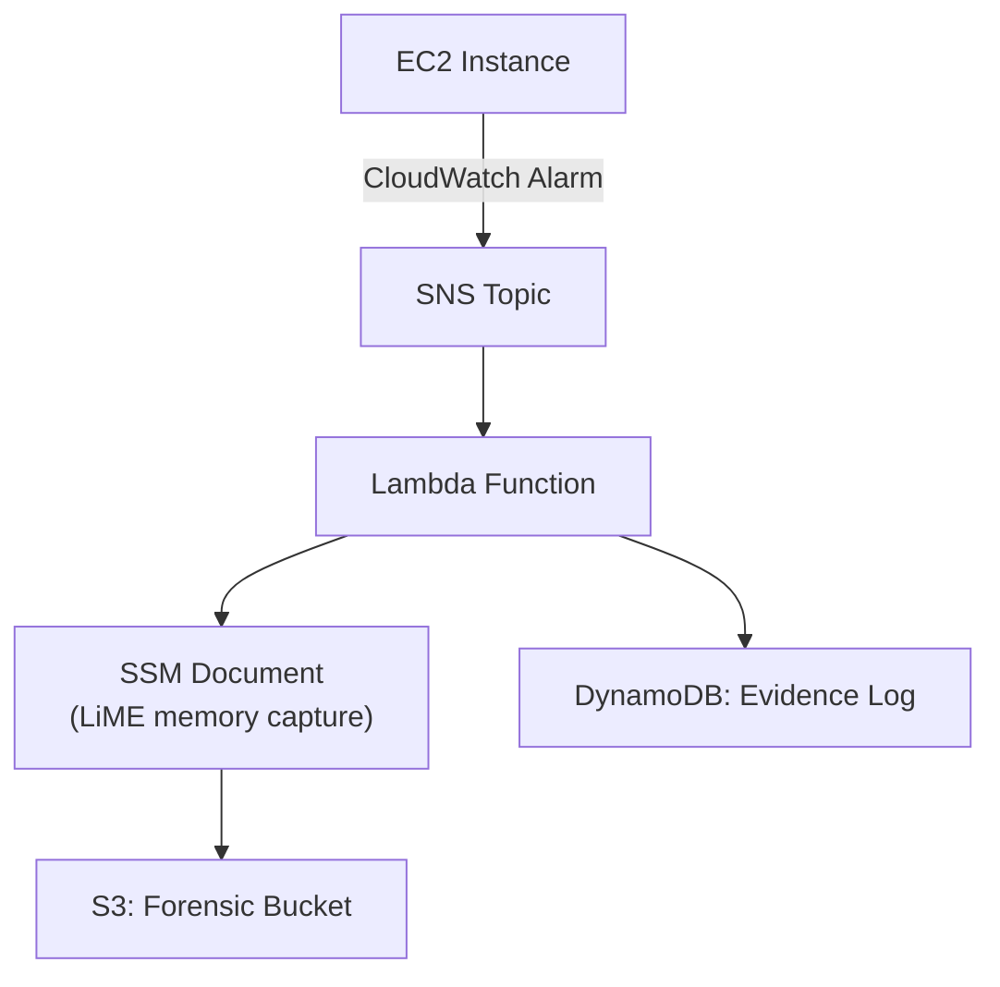

# Automated Forensic Solution for AWS EC2 Instances

An opinionated, fully-automated workflow for **memory acquisition and evidence preservation** on Amazon EC2 during a security incident.  
Built as the final project for *CS-GY 9223 — Cloud Security* at NYU and inspired by AWS’s Automated Forensics Orchestrator reference architecture.

---

## Why this project exists
Traditional cloud forensics is still painfully manual: analysts must connect to a live instance, transfer tooling, and hope nothing changes before data collection completes.  
This repository codifies an **event-driven, repeatable pipeline** that:

* Detects suspicious behaviour (e.g., CPU spikes) through Amazon CloudWatch  
* Triggers Amazon SNS → AWS Lambda to run a **memory-capture SSM document** on the target instance  
* Stores compressed dumps in a forensics-only S3 bucket for later analysis with tools such as **Volatility 3**  
* Records all steps in DynamoDB for chain-of-custody auditing
---

---
- CloudWatch – Monitors metrics (CPU Utilization, network I/O, custom GuardDuty findings)
- SNS – Fan-out alerting & decoupling
- Lambda – Python 3.9 runtime that:
- Validates event details
- Invokes the SSM document on the target instance
- Streams status to DynamoDB
- SSM Document – Runs LiME to dump /dev/mem to a tmpfs volume, then uploads to S3
- S3 (Glacier tier) – Tamper-evident, versioned evidence storage
- DynamoDB – Immutable log of each acquisition (timestamps, instance ID, dump SHA-256)
